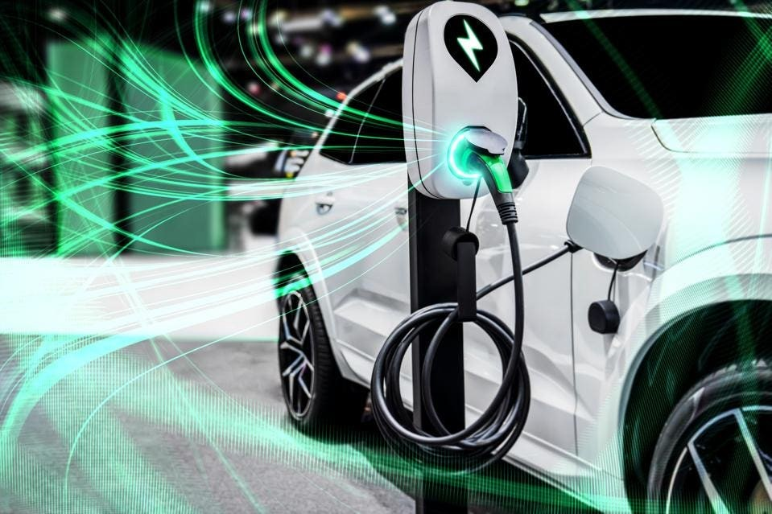

# Electric-Vehicle-Analysis

## Introduction

With the rising need to save the environment from high-level carbon emission associated with the transport sector, battery-powered Electric Vehicles (EVs) have been the alternative to Internal Combustion Engines (ICEs) that run on petrol and other forms of fossil fuels. This project focuses on the analysis of Battery Electric Vehicles (BEVs), Plug-in Hybrid Electric Vehicles (PHEVs), and their Clean Alternative Fuel Vehicles (CAFVs) eligibility. The dataset was explored in Power Query and visualised in Power BI.

**_Disclaimer_**: _The EV image (just before the introduction) was gotten from forbes.com and has only been used for illustrative purposes. Also, the dataset does not represent the city or brand mentioned, and has been utilised to demonstrate the various functions in Power BI._

## Skills Demonstrated

* Data Assessment
* Data Visualisation

## Problem Statement

* What is the total number of vehicles in the dataset, to understand the market size and growth?
* Considering the technological advancements and efficiency of EVs, find out the average electric range.
* Analyse the total number of Battery Electric Vehicles (BEVs) and show its percentage, with respect to the total number of EVs, showing insights into the dominance of fully electric models.
* Analyse the total number of Plug-in Hybrid Electric Vehicles (PHEVs), as well as its percentage of the total number of EVs, providing insights into the market share of plug-in hybrid models.
* Visualise the following:
- Distribution of EVs over the years (from 2011) to provide insights into the growth pattern and adaptation trends
- Geographical distribution of EVs across the various states in the dataset, to identify the regions with a higher adaptation rate.
- Top 10 manufacturers and brands of EVs, by total number of EVs, providing insights into the brands with market dominance.
- Show the portion of EVs that are eligible for Clean Alternative Fuel Vehicle (CAFV) incentives, to highlight the impact of incentives on vehicle adaptation. 
- Top 10 vehicles by make.
- Total vehicles by Clean Alternative Fuel Vehicle (CAFV) eligibility.

## Data Sourcing

The dataset having 10,830 rows and 17 columns was sourced from [Kaggle](https://www.kaggle.com/datasets/utkarshx27/electric-vehicle-population-data)

## Data Assessment

After importing the dataset into Power Query, the data was assessed for errors, and to ensure that there was no null value by activating the column distribution and column quality functions. 

## Data Visualisation

This section provides solutions to the problem statements in different charts on a dashbord. Period covered was between 2011 and 2024.

## Conclusion
* Total vehicles between 2011 and 2024 was approximately 178,000.
* Based on the data, the average Electric Range for the period was 58.80km.
* Highest total number of vehicles (57,587) by model year was recorded in 2023, and the trend of total EVs between 2011 and 2024 indicates that EVs are gaining more acceptance in the market as the transition to cleaner energy continues. The sudden drop in 2024 could be as a result of incomplete data as the year is yet to come to an end.
* Tesla recorded the highest total number of vehicles (79,619) by make.
* Battery Electric Vehicles (BEVs) was 78% of the total vehicles analysed in this project.
* Plug-in Hybrid Electric Vehicles (PHEVs) made up 22% of the total vehicles for the analysis.
* Regarding the Clean Alternative Fuel Vehicle (CAFV) eligibility, 37.27% were CAFV eligible, 51.71% had unknown eligibility as their battery range had not yet been researched, and 11.01% were not eligible due to low battery range.
* Model Y had the highest total number of vehicles (35,989) by model.

## Recommendation
* More research should be done on the battery range of the electric vehicles with 51.71% eligibility to offer more insight into the 91,950 vehicles that make up this percentage.
* On the PHEVs, more data would be needed to know the type of additional fuels that power these vehicles, analyse their environmental impact, and access their environmental sustainability.

  

Special thanks - Data Tutorials

